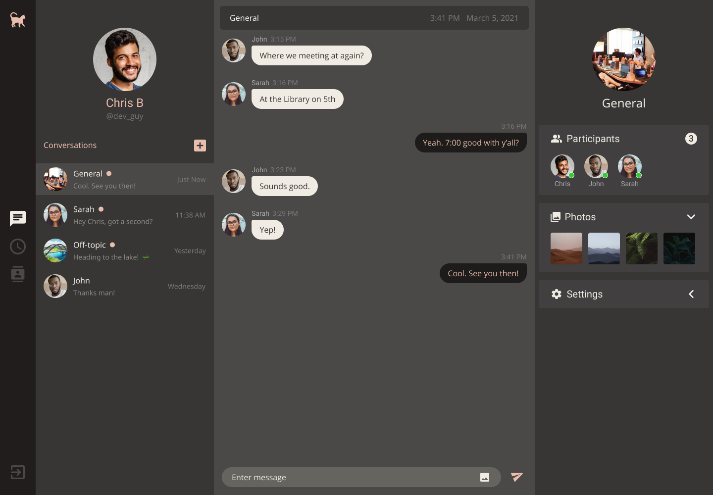

# Le Chat Deluxe

## Description
Le Chat Deluxe is a group chat application. It started as a UI design project where I wanted to realize a design from concept to completion. I first created [Le Chat](https://github.com/i-k0n/le-chat-app) which was a fun starter design project, and wanted to try something more complex with Le Chat Deluxe.

## Technologies

[React](https://reactjs.org/) - Le Chat Deluxe is built using React
[Chat Engine](https://chatengine.io/) - The underlying chat framework runs on Chat Engine
[Axios](https://www.npmjs.com/package/axios) - API calls are made using Axios

## Vision

As this is mostly a UI design challenge, there will be no new features added once the project is fully styled.

## Stage

Le Chat Deluxe is a work-in-progress. The app currently is fully functioning due to being a customized Chat Engine app. The chat feed (middle panel) is currently the only fully-styled section.

## Installation
In the project directory, you can run: `yarn start`
